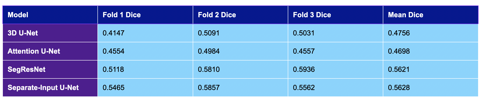
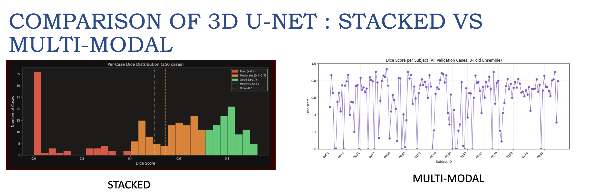
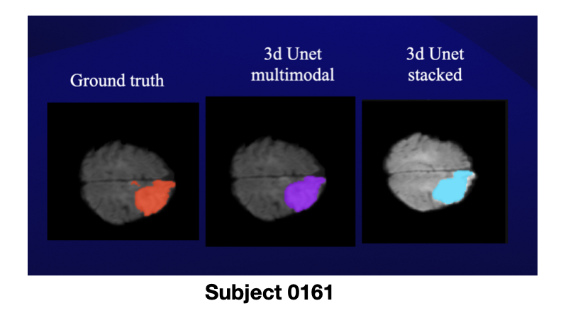

<h2 align="center">Ischemic Stroke Lesion Segmentation on ISLES 2022</h2>

  A comparative study of 3D deep learning architectures for multimodal MRI stroke lesion segmentation,
  including a proposed <b>separate-encoder U-Net</b> that achieved the highest mean Dice score.

<h3>🧠 Project Overview</h3>

Ischemic stroke is a leading cause of disability worldwide. Accurate segmentation of stroke lesions
from MRI is critical for diagnosis and treatment planning. This project benchmarks four 3D deep learning
architectures on the ISLES 2022 dataset and proposes a <b>separate-encoder multimodal U-Net</b>
that processes DWI, ADC, and FLAIR independently before feature fusion — achieving the best mean Dice
among all tested models.

<h3>📂 Dataset</h3>
<ul>
  <li><b>ISLES 2022</b>: 400 multi-center MRI cases (250 training, 150 test)</li>
  <li><b>Modalities</b>: DWI, ADC, FLAIR (.nii.gz)</li>
  <li><b>Centers</b>: Three stroke centers in Germany and Switzerland (Philips & Siemens, 1.5T and 3T)</li>
  <li><b>Ground truth</b>: Manually verified lesion masks via ITK-SNAP and 3D Slicer</li>
</ul>

<h3>⚙️ Preprocessing</h3>
<ul>
  <li>Resampled all modalities to uniform 1×1×1 mm voxel spacing</li>
  <li>Resized volumes to fixed 128×128×128 spatial dimensions</li>
  <li>Intensity normalisation using 1st–99th percentile clipping</li>
  <li>FLAIR registered to DWI space; skull stripping via HD-BET</li>
  <li><b>Stacked input</b>: DWI + ADC + FLAIR concatenated as a 3-channel volume (3×128×128×128)</li>
  <li><b>Separate input</b>: each modality fed independently into its own encoder</li>
</ul>

<h3>🏗️ Architectures</h3>

<h4>1. 3D U-Net (Stacked Input)</h4>

Standard encoder-decoder with skip connections. All three modalities stacked as a single 3-channel volume input.

<h4>2. 3D Attention U-Net (Stacked Input)</h4>

Adds attention gates to the U-Net decoder to focus feature learning on lesion-relevant regions.

<h4>3. SegResNet (Stacked Input)</h4>

3D residual network from MONAI with residual blocks for more stable gradient flow and optimisation.

<h4>4. Separate-Encoder U-Net (Proposed)</h4>

  Each modality (DWI, ADC, FLAIR) passes through its own independent encoder (4 blocks: 16→32→64→128 channels).
  All three encoder outputs are concatenated at a shared bottleneck (384→256 channels) and decoded through
  a single decoder with multi-encoder skip connections fused at each level.
  This preserves modality-specific features before fusion, unlike stacked models which mix modalities at layer 1.

<h3>📈 Results</h3>

  

<table align="center">
  <tr>
    <th>Model</th>
    <th>Fold 1 Dice</th>
    <th>Fold 2 Dice</th>
    <th>Fold 3 Dice</th>
    <th>Mean Dice</th>
  </tr>
  <tr>
    <td>3D U-Net</td>
    <td>0.4147</td>
    <td>0.5091</td>
    <td>0.5031</td>
    <td>0.4756</td>
  </tr>
  <tr>
    <td>Attention U-Net</td>
    <td>0.4554</td>
    <td>0.4984</td>
    <td>0.4557</td>
    <td>0.4698</td>
  </tr>
  <tr>
    <td>SegResNet</td>
    <td>0.5118</td>
    <td>0.5810</td>
    <td>0.5936</td>
    <td>0.5621</td>
  </tr>
  <tr>
    <td><b>Separate-Encoder U-Net (Proposed)</b></td>
    <td><b>0.5465</b></td>
    <td><b>0.5857</b></td>
    <td><b>0.5562</b></td>
    <td><b>0.5628</b></td>
  </tr>
</table>

<i>
  The separate-encoder U-Net achieved the highest mean Dice (0.5628).
  SegResNet achieved the best single-fold score (0.5936).
  Results are consistent with the ISLES 2022 challenge benchmark range of 0.4–0.6 for single models.
</i>

  

<i>Per-case Dice score distribution across 250 training cases (3-fold ensemble).</i>

<h3>🔬 Qualitative Results</h3>

  

<i>Subject 0161: Ground truth vs 3D U-Net multimodal vs 3D U-Net stacked predictions.</i>

<h3>💡 Key Finding</h3>

Stacked-input models treat DWI, ADC, and FLAIR as interchangeable channels (like RGB), mixing them
at the very first layer. However, these modalities carry fundamentally different medical information —
DWI is highly sensitive to early ischemic injury, ADC provides quantitative diffusion information,
and FLAIR highlights edema while suppressing CSF. The separate-encoder design allows each modality
to develop independent representations before late fusion, leading to better segmentation performance.

<h3>🗂️ Repository Structure</h3>
<pre><code>ischemic-stroke-lesion-segmentation/
├── 3D_U-net_MIA.ipynb               ← 3D U-Net (stacked)
├── 3D_Unet_separate.ipynb           ← Separate-Encoder U-Net (proposed)
├── attentionUnet_ISLES2022.ipynb    ← Attention U-Net
├── SegResNet_ISLES2022.ipynb        ← SegResNet
├── assets/
│   ├── subject0161_comparison.png
│   ├── results_table.png
│   └── dice_distribution.png
└── README.md
</code></pre>

<h3>🛠️ Tools & Technologies</h3>
<ul>
  <li>Python, PyTorch, MONAI</li>
  <li>SimpleITK, NiBabel</li>
  <li>ITK-SNAP, 3D Slicer (visualisation)</li>
  <li>3-fold cross-validation, 30 epochs per fold</li>
  <li>Dice loss, learning rates: 5×10⁻⁴ (U-Net variants), 1×10⁻⁴ (SegResNet)</li>
</ul>
